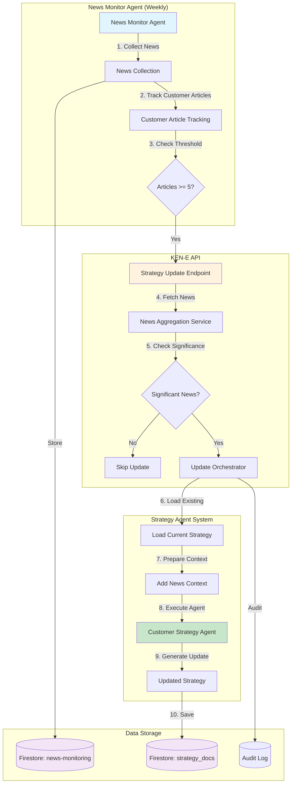

# Customer Strategy & News Monitor Integration

## Overview
This document describes the integration between the Customer Strategy Agent and the News Monitor Agent, enabling automatic strategy updates based on recent news articles related to customer keywords.

## Architecture

### System Flow Diagram



## Components

### 1. News Aggregation Service
**Location:** `api/src/kene_api/services/strategy_news_service.py`

**Key Functions:**
- `get_customer_news_for_strategy()` - Fetches recent customer-related news
- `check_for_significant_news_update()` - Determines if update is warranted
- `format_news_for_agent()` - Prepares news for agent consumption

**Features:**
- Fetches articles from `news-monitoring/{account_id}/customers/{keyword}/articles`
- Configurable time window (default: 7 days)
- Configurable threshold (default: 5 articles minimum)
- Formats news into structured summaries

### 2. Customer Strategy Agent Enhancement
**Location:** `app/adk/agents/strategy_agent/agents.py`

**Changes:**
- Added `customer_news_context` field to `StrategyContext` model
- Modified `create_customer_strategist()` to include news section in instructions
- Agent incorporates news insights into personas and journey maps

**News Integration:**
```python
# Agent instruction includes news when available
if context and context.customer_news_context:
    news_section = f"""
# RECENT CUSTOMER NEWS
{context.customer_news_context}
"""
```

### 3. Strategy Update Orchestrator
**Location:** `app/adk/agents/strategy_agent/news_update_orchestrator.py`

**Workflow:**
1. Check news significance via news service
2. Fetch account details from Neo4j
3. Load existing customer strategy from Firestore
4. Create context with news and existing strategy
5. Prepare for agent execution

### 4. API Endpoint
**Location:** `api/src/kene_api/routers/strategy.py`

**Endpoint:** `POST /api/v1/strategies/{account_id}/update-customer-from-news`

**Parameters:**
- `since_days` (int, default: 7) - Days to look back for news
- `news_threshold` (int, default: 5) - Minimum articles to trigger update

**Process:**
1. Verify user has edit permissions
2. Check for significant news
3. Get account details from Neo4j
4. Load existing strategy
5. Execute strategy agent via Vertex AI
6. Save updated strategy with metadata
7. Log audit trail

### 5. News Monitor Integration
**Location:** `news_monitor_agent/src/news_monitor_agent/agent/news_monitor.py`

**New Features:**
- `trigger_strategy_updates_for_customer_news()` method
- Tracks customer article counts during collection
- Optional `trigger_strategy_updates` parameter in `run_weekly_collection()`
- Calls KEN-E API to trigger updates for eligible accounts

## Data Flow

### News Collection Path
```
Customer Keywords → Serper API → Articles → Firestore (news-monitoring)
```

### Strategy Update Path
```
News Articles → Aggregation → Context Creation → Agent Execution → Strategy Update → Firestore (strategy_docs)
```

## Storage Structure

### News Articles
```
firestore:
  news-monitoring/
    {account_id}/
      customers/
        {sanitized_keyword}/
          articles/
            {article_id}: {
              title, link, snippet, 
              publisher, date, search_rank
            }
```

### Strategy Documents
```
firestore:
  strategy_docs_{account_id}/
    customer_strategy: {
      doc_type: "customer_strategy",
      content: {...strategy fields...},
      version: 1,
      update_metadata: {
        trigger: "news",
        article_count: 10,
        keywords_with_news: ["keyword1", "keyword2"]
      }
    }
```

## Configuration

### Environment Variables
No new environment variables required - uses existing:
- `GOOGLE_CLOUD_PROJECT_ID`
- `VERTEX_AI_AGENT_ENGINE_ID`
- `VERTEX_AI_LOCATION`

### Thresholds
- **News Threshold:** 5 articles (configurable per request)
- **Time Window:** 7 days (configurable per request)
- **Concurrent Processing:** 5 accounts (news monitor)

## Usage Examples

### Manual Trigger via API
```bash
curl -X POST "http://localhost:8000/api/v1/strategies/{account_id}/update-customer-from-news" \
  -H "Authorization: Bearer {token}" \
  -H "Content-Type: application/json" \
  -d '{
    "since_days": 7,
    "news_threshold": 5
  }'
```

### Automatic Trigger from News Monitor
```python
# In news monitor weekly run
agent = NewsMonitorAgent(environment="production")
summary = await agent.run_weekly_collection(
    max_concurrent_accounts=5,
    trigger_strategy_updates=True  # Enable automatic updates
)
```

## Response Format

### Success Response
```json
{
  "success": true,
  "reason": "Found 12 new customer articles across 3 keywords",
  "article_count": 12,
  "keywords_with_news": ["cloud computing", "AI tools", "data analytics"],
  "strategy_updated": true,
  "version": 2,
  "message": "Customer strategy successfully updated based on 12 news articles"
}
```

### Insufficient News Response
```json
{
  "success": false,
  "reason": "Only 2 articles found (threshold: 5)",
  "article_count": 2,
  "keywords_affected": 1,
  "message": "Not enough new customer news to warrant strategy update"
}
```

## Security & Permissions

- **Access Control:** Requires `edit` permission on account
- **Audit Logging:** All updates logged with user, timestamp, and metadata
- **Super Admin Override:** Super admins can update any account

## Benefits

1. **Automated Updates:** Strategies stay current with market developments
2. **Threshold-Based:** Avoids unnecessary updates for minor news
3. **Incremental:** Builds on existing strategy rather than replacing
4. **Traceable:** Full audit trail of what triggered updates
5. **Configurable:** Flexible thresholds and time windows

## Future Enhancements

1. **Additional Strategy Types:** Extend to competitive, marketing strategies
2. **News Scoring:** Weight articles by relevance/importance
3. **Scheduled Updates:** Cron-based automatic triggering
4. **Notification System:** Alert users when strategies are updated
5. **Rollback Capability:** Version history for strategy documents
6. **Analytics Dashboard:** Track update frequency and impact

## Testing

### Test Flow
1. Create account with customer keywords
2. Run news monitor to collect articles
3. Verify articles saved in Firestore
4. Trigger strategy update via API
5. Confirm strategy document updated with news insights

### Key Test Points
- News threshold enforcement
- Proper keyword sanitization
- Context passing to agent
- Strategy document persistence
- Audit trail completeness