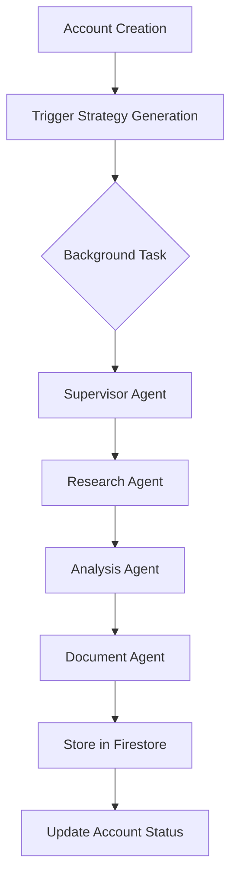

# Implementation Plan for Code Review Recommendations

## Overview
This document outlines the comprehensive implementation plan for the five key recommendations from the code review of the marketing strategy generation and account creation fixes.

## Timeline
**Total Duration**: 2-3 weeks  
**Priority**: High for items 1-3, Medium for items 4-5

---

## 1. Add Progress Tracking (Server-Sent Events)
**Timeline**: 3-4 days  
**Priority**: HIGH  
**Complexity**: Medium

### Objectives
- Provide real-time feedback during long-running strategy generation
- Improve user experience with visible progress indicators
- Prevent timeout perception issues

### Implementation Steps

#### Phase 1: Backend SSE Infrastructure (Day 1-2)
```python
# api/src/kene_api/routers/strategy_progress.py
from fastapi import APIRouter
from sse_starlette.sse import EventSourceResponse
import asyncio
from typing import AsyncGenerator

router = APIRouter(tags=["strategy-progress"])

@router.get("/api/v1/strategy/{account_id}/progress")
async def strategy_progress(account_id: str) -> EventSourceResponse:
    async def event_generator() -> AsyncGenerator:
        while True:
            progress = await get_strategy_progress(account_id)
            yield {
                "event": "progress",
                "data": json.dumps({
                    "account_id": account_id,
                    "status": progress.status,
                    "percentage": progress.percentage,
                    "current_step": progress.current_step,
                    "message": progress.message
                })
            }
            if progress.status in ["completed", "failed"]:
                break
            await asyncio.sleep(1)
    
    return EventSourceResponse(event_generator())
```

#### Phase 2: Progress Storage (Day 2)
```python
# api/src/kene_api/services/progress_service.py
import redis.asyncio as redis
from typing import Optional
from pydantic import BaseModel

class StrategyProgress(BaseModel):
    account_id: str
    status: str  # pending, processing, completed, failed
    percentage: int
    current_step: str
    message: str
    started_at: datetime
    updated_at: datetime

class ProgressService:
    def __init__(self):
        self.redis_client = redis.Redis(
            host=settings.redis_host,
            port=settings.redis_port,
            decode_responses=True
        )
    
    async def update_progress(
        self, 
        account_id: str, 
        percentage: int, 
        step: str, 
        message: str
    ):
        key = f"strategy:progress:{account_id}"
        progress = StrategyProgress(
            account_id=account_id,
            status="processing",
            percentage=percentage,
            current_step=step,
            message=message,
            updated_at=datetime.now()
        )
        await self.redis_client.setex(
            key, 
            3600,  # 1 hour TTL
            progress.json()
        )
```

#### Phase 3: Frontend Integration (Day 3-4)
```typescript
// frontend/src/hooks/useStrategyProgress.ts
import { useEffect, useState } from 'react';

interface StrategyProgress {
  status: string;
  percentage: number;
  currentStep: string;
  message: string;
}

export function useStrategyProgress(accountId: string) {
  const [progress, setProgress] = useState<StrategyProgress>();
  const [error, setError] = useState<string>();

  useEffect(() => {
    if (!accountId) return;

    const eventSource = new EventSource(
      `${API_BASE_URL}/api/v1/strategy/${accountId}/progress`
    );

    eventSource.addEventListener('progress', (event) => {
      const data = JSON.parse(event.data);
      setProgress(data);
    });

    eventSource.onerror = (error) => {
      setError('Connection lost');
      eventSource.close();
    };

    return () => eventSource.close();
  }, [accountId]);

  return { progress, error };
}

// Component usage
function AccountCreationProgress({ accountId }) {
  const { progress } = useStrategyProgress(accountId);
  
  return (
    <div className="space-y-4">
      <Progress value={progress?.percentage || 0} />
      <p className="text-sm text-gray-600">{progress?.message}</p>
      <Badge>{progress?.currentStep}</Badge>
    </div>
  );
}
```

### Files to Create/Modify
- [ ] `api/src/kene_api/routers/strategy_progress.py` (new)
- [ ] `api/src/kene_api/services/progress_service.py` (new)
- [ ] `api/src/kene_api/tasks/strategy_tasks.py` (modify to update progress)
- [ ] `frontend/src/hooks/useStrategyProgress.ts` (new)
- [ ] `frontend/src/components/ui/StrategyProgress.tsx` (new)
- [ ] `frontend/src/pages/components/AccountsManagement.tsx` (modify)

---

## 2. Add Circuit Breaker Pattern for Neo4j
**Timeline**: 2 days  
**Priority**: HIGH  
**Complexity**: Medium

### Objectives
- Fail fast when Neo4j is unavailable
- Prevent cascade failures
- Improve system resilience

### Implementation Steps

#### Phase 1: Circuit Breaker Implementation (Day 1)
```python
# api/src/kene_api/utils/circuit_breaker.py
from datetime import datetime, timedelta
from enum import Enum
from typing import Optional, Callable
import asyncio
import logging

logger = logging.getLogger(__name__)

class CircuitState(Enum):
    CLOSED = "closed"  # Normal operation
    OPEN = "open"      # Failing, reject calls
    HALF_OPEN = "half_open"  # Testing if service recovered

class CircuitBreaker:
    def __init__(
        self,
        failure_threshold: int = 5,
        recovery_timeout: int = 60,
        expected_exception: type = Exception
    ):
        self.failure_threshold = failure_threshold
        self.recovery_timeout = recovery_timeout
        self.expected_exception = expected_exception
        self.failure_count = 0
        self.last_failure_time: Optional[datetime] = None
        self.state = CircuitState.CLOSED
    
    async def call(self, func: Callable, *args, **kwargs):
        if self.state == CircuitState.OPEN:
            if self._should_attempt_reset():
                self.state = CircuitState.HALF_OPEN
            else:
                raise Exception("Circuit breaker is OPEN")
        
        try:
            result = await func(*args, **kwargs)
            self._on_success()
            return result
        except self.expected_exception as e:
            self._on_failure()
            raise
    
    def _on_success(self):
        if self.state == CircuitState.HALF_OPEN:
            logger.info("Circuit breaker: Service recovered, closing circuit")
        self.failure_count = 0
        self.state = CircuitState.CLOSED
    
    def _on_failure(self):
        self.failure_count += 1
        self.last_failure_time = datetime.now()
        if self.failure_count >= self.failure_threshold:
            self.state = CircuitState.OPEN
            logger.warning(f"Circuit breaker: Opening circuit after {self.failure_count} failures")
    
    def _should_attempt_reset(self) -> bool:
        return (
            self.last_failure_time and
            datetime.now() - self.last_failure_time > timedelta(seconds=self.recovery_timeout)
        )
```

#### Phase 2: Neo4j Service Integration (Day 2)
```python
# api/src/kene_api/database.py (modify)
from .utils.circuit_breaker import CircuitBreaker

class Neo4jService:
    def __init__(self):
        self.driver: AsyncDriver | None = None
        self.circuit_breaker = CircuitBreaker(
            failure_threshold=3,
            recovery_timeout=30,
            expected_exception=Neo4jError
        )
    
    async def execute_query(
        self, query: str, parameters: dict[str, Any] | None = None
    ) -> list[dict[str, Any]]:
        """Execute with circuit breaker protection."""
        return await self.circuit_breaker.call(
            self._execute_query_internal,
            query,
            parameters
        )
    
    async def _execute_query_internal(
        self, query: str, parameters: dict[str, Any] | None = None
    ) -> list[dict[str, Any]]:
        # Existing query logic
        ...
```

### Files to Create/Modify
- [ ] `api/src/kene_api/utils/circuit_breaker.py` (new)
- [ ] `api/src/kene_api/database.py` (modify)
- [ ] `api/tests/unit/test_circuit_breaker.py` (new)

---

## 3. Document Strategy Generation Architecture
**Timeline**: 1 day  
**Priority**: HIGH  
**Complexity**: Low

### Implementation Steps

#### Create Architecture Documentation
```markdown
# STRATEGY_GENERATION.md

## Multi-Agent Strategy Generation Architecture

### Overview
The strategy generation system uses a multi-agent architecture with:
- Supervisor Agent (orchestrator)
- Research Agent (data gathering)
- Analysis Agent (insights generation)
- Document Agent (content creation)

### Flow Diagram


### Agent Responsibilities
1. **Supervisor Agent**
   - Coordinates workflow
   - Manages state between agents
   - Handles error recovery

2. **Research Agent**
   - Gathers company information
   - Analyzes websites
   - Collects market data

[Continue with detailed documentation...]
```

### Files to Create
- [ ] `STRATEGY_GENERATION.md` (new)
- [ ] `app/adk/agents/strategy_agent/README.md` (new)
- [ ] Update main `README.md` with reference

---

## 4. Configuration Management
**Timeline**: 2 days  
**Priority**: MEDIUM  
**Complexity**: Low

### Objectives
- Centralize all configuration values
- Support environment-specific configs
- Improve maintainability

### Implementation Steps

#### Phase 1: Backend Configuration (Day 1)
```python
# api/src/kene_api/config/settings.py
from pydantic_settings import BaseSettings
from functools import lru_cache

class Settings(BaseSettings):
    # API Settings
    api_timeout: int = 300000  # 5 minutes
    api_max_retries: int = 3
    
    # Neo4j Settings
    neo4j_connection_timeout: float = 10.0
    neo4j_max_connection_lifetime: int = 300
    neo4j_max_pool_size: int = 25
    neo4j_connection_acquisition_timeout: float = 60.0
    neo4j_health_check_interval: int = 30
    
    # Circuit Breaker Settings
    circuit_breaker_failure_threshold: int = 5
    circuit_breaker_recovery_timeout: int = 60
    
    # Strategy Generation Settings
    strategy_generation_timeout: int = 600  # 10 minutes
    strategy_max_concurrent_generations: int = 5
    
    # Redis Settings (for progress tracking)
    redis_host: str = "localhost"
    redis_port: int = 6379
    redis_ttl: int = 3600
    
    class Config:
        env_file = ".env"
        env_prefix = "KENE_"

@lru_cache()
def get_settings():
    return Settings()

settings = get_settings()
```

#### Phase 2: Frontend Configuration (Day 1)
```typescript
// frontend/src/config/settings.ts
interface AppSettings {
  api: {
    defaultTimeout: number;
    accountCreationTimeout: number;
    maxRetries: number;
  };
  features: {
    enableProgressTracking: boolean;
    enableStrategyGeneration: boolean;
  };
  monitoring: {
    enableMetrics: boolean;
    metricsEndpoint: string;
  };
}

const settings: AppSettings = {
  api: {
    defaultTimeout: parseInt(import.meta.env.VITE_API_TIMEOUT || "300000"),
    accountCreationTimeout: parseInt(import.meta.env.VITE_ACCOUNT_TIMEOUT || "300000"),
    maxRetries: parseInt(import.meta.env.VITE_API_MAX_RETRIES || "3"),
  },
  features: {
    enableProgressTracking: import.meta.env.VITE_ENABLE_PROGRESS === "true",
    enableStrategyGeneration: import.meta.env.VITE_ENABLE_STRATEGY === "true",
  },
  monitoring: {
    enableMetrics: import.meta.env.VITE_ENABLE_METRICS === "true",
    metricsEndpoint: import.meta.env.VITE_METRICS_ENDPOINT || "/metrics",
  },
};

export default settings;
```

#### Phase 3: Environment Files (Day 2)
```bash
# .env.development
KENE_API_TIMEOUT=300000
KENE_NEO4J_CONNECTION_TIMEOUT=10.0
KENE_CIRCUIT_BREAKER_FAILURE_THRESHOLD=5
KENE_REDIS_HOST=localhost
KENE_STRATEGY_GENERATION_TIMEOUT=600

# .env.staging
KENE_API_TIMEOUT=300000
KENE_NEO4J_CONNECTION_TIMEOUT=15.0
KENE_CIRCUIT_BREAKER_FAILURE_THRESHOLD=3
KENE_REDIS_HOST=redis-staging.example.com
KENE_STRATEGY_GENERATION_TIMEOUT=900

# .env.production
KENE_API_TIMEOUT=180000
KENE_NEO4J_CONNECTION_TIMEOUT=20.0
KENE_CIRCUIT_BREAKER_FAILURE_THRESHOLD=2
KENE_REDIS_HOST=redis-prod.example.com
KENE_STRATEGY_GENERATION_TIMEOUT=1200
```

### Files to Create/Modify
- [ ] `api/src/kene_api/config/settings.py` (new)
- [ ] `frontend/src/config/settings.ts` (new)
- [ ] `.env.development`, `.env.staging`, `.env.production` (modify)
- [ ] Update all hardcoded values to use config

---

## 5. Monitoring and Metrics
**Timeline**: 3 days  
**Priority**: MEDIUM  
**Complexity**: Medium

### Objectives
- Track strategy generation performance
- Monitor system health
- Enable data-driven optimization

### Implementation Steps

#### Phase 1: Metrics Collection (Day 1-2)
```python
# api/src/kene_api/monitoring/metrics.py
from prometheus_client import Counter, Histogram, Gauge, generate_latest
from fastapi import APIRouter
from datetime import datetime

# Define metrics
strategy_generation_counter = Counter(
    'strategy_generation_total',
    'Total number of strategy generations',
    ['status', 'account_id']
)

strategy_generation_duration = Histogram(
    'strategy_generation_duration_seconds',
    'Duration of strategy generation in seconds',
    buckets=[10, 30, 60, 120, 300, 600]
)

neo4j_connection_pool = Gauge(
    'neo4j_connection_pool_size',
    'Current Neo4j connection pool size'
)

api_request_duration = Histogram(
    'api_request_duration_seconds',
    'API request duration in seconds',
    ['method', 'endpoint', 'status']
)

circuit_breaker_state = Gauge(
    'circuit_breaker_state',
    'Circuit breaker state (0=closed, 1=open, 2=half-open)',
    ['service']
)

# Metrics endpoint
router = APIRouter()

@router.get("/metrics")
async def get_metrics():
    return Response(generate_latest(), media_type="text/plain")

# Decorator for timing functions
def track_duration(metric: Histogram):
    def decorator(func):
        async def wrapper(*args, **kwargs):
            start = datetime.now()
            try:
                result = await func(*args, **kwargs)
                return result
            finally:
                duration = (datetime.now() - start).total_seconds()
                metric.observe(duration)
        return wrapper
    return decorator
```

#### Phase 2: Integration with Services (Day 2)
```python
# api/src/kene_api/tasks/strategy_tasks.py (modify)
from ..monitoring.metrics import (
    strategy_generation_counter,
    strategy_generation_duration,
    track_duration
)

@track_duration(strategy_generation_duration)
async def trigger_strategy_generation(
    account_id: str,
    company_name: str,
    ...
) -> None:
    try:
        # Existing logic
        ...
        strategy_generation_counter.labels(status='success', account_id=account_id).inc()
    except Exception as e:
        strategy_generation_counter.labels(status='failure', account_id=account_id).inc()
        raise
```

#### Phase 3: Dashboard Setup (Day 3)
```yaml
# monitoring/grafana/dashboards/strategy_generation.json
{
  "dashboard": {
    "title": "Strategy Generation Metrics",
    "panels": [
      {
        "title": "Generation Success Rate",
        "targets": [
          {
            "expr": "rate(strategy_generation_total{status='success'}[5m]) / rate(strategy_generation_total[5m])"
          }
        ]
      },
      {
        "title": "Average Generation Time",
        "targets": [
          {
            "expr": "histogram_quantile(0.95, strategy_generation_duration_seconds)"
          }
        ]
      },
      {
        "title": "Neo4j Circuit Breaker Status",
        "targets": [
          {
            "expr": "circuit_breaker_state{service='neo4j'}"
          }
        ]
      }
    ]
  }
}
```

### Files to Create/Modify
- [ ] `api/src/kene_api/monitoring/metrics.py` (new)
- [ ] `api/src/kene_api/monitoring/__init__.py` (new)
- [ ] `monitoring/grafana/dashboards/strategy_generation.json` (new)
- [ ] `monitoring/prometheus/prometheus.yml` (new)
- [ ] Modify services to include metrics

---

## Testing Strategy

### Unit Tests
- [ ] Circuit breaker logic
- [ ] Progress tracking service
- [ ] Configuration loading
- [ ] Metrics collection

### Integration Tests
- [ ] SSE progress updates
- [ ] Circuit breaker with Neo4j
- [ ] End-to-end strategy generation with monitoring

### Load Tests
- [ ] Strategy generation under load
- [ ] Circuit breaker behavior under failure
- [ ] Progress tracking with multiple concurrent generations

---

## Rollout Plan

### Phase 1: Foundation (Week 1)
1. Configuration Management
2. Architecture Documentation
3. Circuit Breaker Implementation

### Phase 2: User Experience (Week 2)
4. Progress Tracking (SSE)
5. Initial Metrics Collection

### Phase 3: Observability (Week 3)
6. Complete Monitoring Setup
7. Dashboard Creation
8. Alert Configuration

---

## Success Metrics

1. **Progress Tracking**
   - 100% of strategy generations show progress
   - User satisfaction score > 4.5/5

2. **Circuit Breaker**
   - 50% reduction in cascade failures
   - <1s fail-fast response time

3. **Documentation**
   - 100% of new developers understand architecture within 1 hour
   - Reduced onboarding time by 30%

4. **Configuration**
   - Zero hardcoded timeouts/limits
   - 90% reduction in config-related bugs

5. **Monitoring**
   - 99.9% visibility into strategy generation
   - <5 minute MTTR for issues

---

## Risk Mitigation

### Risk 1: SSE Connection Stability
**Mitigation**: Implement reconnection logic and fallback polling

### Risk 2: Circuit Breaker False Positives
**Mitigation**: Tunable thresholds and monitoring

### Risk 3: Configuration Complexity
**Mitigation**: Sensible defaults and validation

### Risk 4: Monitoring Overhead
**Mitigation**: Sampling and aggregation strategies

---

## Dependencies

### External Libraries
```toml
# api/pyproject.toml additions
sse-starlette = "^1.6.5"
prometheus-client = "^0.19.0"
pydantic-settings = "^2.1.0"

# frontend/package.json additions
"event-source-polyfill": "^1.0.31"
```

### Infrastructure Requirements
- Redis instance for progress tracking
- Prometheus for metrics collection
- Grafana for visualization (optional)

---

## Team Assignments

| Component | Lead Developer | Reviewer | Timeline |
|-----------|---------------|----------|----------|
| Progress Tracking | TBD | TBD | Week 1 |
| Circuit Breaker | TBD | TBD | Week 1 |
| Documentation | TBD | TBD | Week 1 |
| Configuration | TBD | TBD | Week 2 |
| Monitoring | TBD | TBD | Week 2-3 |

---

## Checklist for Completion

### Week 1 Deliverables
- [ ] Circuit breaker implemented and tested
- [ ] Architecture documentation complete
- [ ] Configuration structure defined

### Week 2 Deliverables
- [ ] SSE progress tracking functional
- [ ] Configuration fully migrated
- [ ] Basic metrics collection working

### Week 3 Deliverables
- [ ] Complete monitoring setup
- [ ] Dashboards created
- [ ] All tests passing
- [ ] Documentation updated

---

## Post-Implementation Review

### Review Criteria
1. All acceptance criteria met
2. Performance benchmarks achieved
3. No regression in existing functionality
4. Documentation complete and accurate

### Metrics to Track (First Month)
- Strategy generation success rate
- Average generation time
- Circuit breaker trigger frequency
- User engagement with progress tracking
- System error rate

---

## Appendix

### A. Code Examples
[Full code examples available in implementation branches]

### B. Configuration Templates
[Environment-specific configurations]

### C. Monitoring Queries
[Prometheus queries for common scenarios]

### D. Troubleshooting Guide
[Common issues and resolutions]