# Strategy Agent Interaction Flow

## Overview
This diagram illustrates how the KEN-E Strategy Agent System creates comprehensive business strategy documents through a sequential pipeline of 5 specialized agents, each with internal refinement loops.

## Architecture Diagram

```mermaid
graph TB
    %% Style definitions
    classDef userNode fill:#e1f5fe,stroke:#01579b,stroke-width:3px
    classDef orchestratorNode fill:#fff3e0,stroke:#e65100,stroke-width:3px
    classDef strategyNode fill:#f3e5f5,stroke:#4a148c,stroke-width:2px
    classDef loopNode fill:#fce4ec,stroke:#880e4f,stroke-width:2px
    classDef toolNode fill:#e8f5e9,stroke:#1b5e20,stroke-width:2px
    classDef dataNode fill:#f5f5f5,stroke:#424242,stroke-width:2px
    classDef contextNode fill:#fff8e1,stroke:#f57c00,stroke-width:3px

    %% User Input
    User[User Request<br/>Company Info]:::userNode
    
    %% Main Orchestrator
    Orchestrator[Strategy Orchestrator<br/>agent.py / agent_v3_proper.py]:::orchestratorNode
    
    %% Strategy Context
    Context[StrategyContext<br/>• company_name<br/>• websites<br/>• industry<br/>• customer_regions<br/>• annual_ad_budget]:::contextNode
    
    %% Firestore Collections
    Firestore[(Firestore<br/>• strategy_doc_guides<br/>• strategy_docs_accountid)]:::dataNode
    
    %% Tool Agents
    GoogleSearch[Google Search Agent<br/>google_search]:::toolNode
    InternalSearch[Internal Search Agent<br/>VertexAiSearchTool]:::toolNode
    
    %% Sequential flow of strategy agents
    subgraph "1. Business Strategy Agent"
        BS_Seq[SequentialAgent]:::strategyNode
        BS_Loop[LoopAgent<br/>Max 3 iterations]:::loopNode
        BS_Strategist[Business Strategist<br/>Creates initial doc]:::strategyNode
        BS_Reviewer[Business Reviewer<br/>Reviews quality]:::strategyNode
        BS_Editor[Business Editor<br/>Refines doc]:::strategyNode
    end
    
    subgraph "2. Competitive Strategy Agent"
        CS_Seq[SequentialAgent]:::strategyNode
        CS_Loop[LoopAgent<br/>Max 3 iterations]:::loopNode
        CS_Strategist[Competitive Strategist<br/>Analyzes competition]:::strategyNode
        CS_Reviewer[Competitive Reviewer<br/>Reviews quality]:::strategyNode
        CS_Editor[Competitive Editor<br/>Refines doc]:::strategyNode
    end
    
    subgraph "3. Customer Strategy Agent"
        CU_Seq[SequentialAgent]:::strategyNode
        CU_Loop[LoopAgent<br/>Max 3 iterations]:::loopNode
        CU_Strategist[Customer Strategist<br/>Creates personas]:::strategyNode
        CU_Reviewer[Customer Reviewer<br/>Reviews quality]:::strategyNode
        CU_Editor[Customer Editor<br/>Refines doc]:::strategyNode
    end
    
    subgraph "4. Marketing Strategy Agent"
        MS_Seq[SequentialAgent]:::strategyNode
        MS_Loop[LoopAgent<br/>Max 3 iterations]:::loopNode
        MS_Strategist[Marketing Strategist<br/>Plans campaigns]:::strategyNode
        MS_Reviewer[Marketing Reviewer<br/>Reviews quality]:::strategyNode
        MS_Editor[Marketing Editor<br/>Refines doc]:::strategyNode
    end
    
    subgraph "5. Brand Guidelines Agent"
        BG_Seq[SequentialAgent]:::strategyNode
        BG_Loop[LoopAgent<br/>Max 3 iterations]:::loopNode
        BG_Strategist[Brand Strategist<br/>Defines guidelines]:::strategyNode
        BG_Reviewer[Brand Reviewer<br/>Reviews quality]:::strategyNode
        BG_Editor[Brand Editor<br/>Refines doc]:::strategyNode
    end
    
    %% Main Flow
    User --> Orchestrator
    Orchestrator --> Context
    Context --> BS_Seq
    
    %% Business Strategy Internal Flow
    BS_Seq --> BS_Loop
    BS_Loop --> BS_Strategist
    BS_Strategist --> BS_Reviewer
    BS_Reviewer --> BS_Editor
    BS_Editor -.->|Not Approved| BS_Strategist
    BS_Editor -->|Approved/<br/>exit_loop| BS_Seq
    
    %% Sequential Dependencies
    BS_Seq ==>|business_strategy<br/>in context| CS_Seq
    
    %% Competitive Strategy Internal Flow
    CS_Seq --> CS_Loop
    CS_Loop --> CS_Strategist
    CS_Strategist --> CS_Reviewer
    CS_Reviewer --> CS_Editor
    CS_Editor -.->|Not Approved| CS_Strategist
    CS_Editor -->|Approved| CS_Seq
    
    CS_Seq ==>|+ competitive_strategy<br/>in context| CU_Seq
    
    %% Customer Strategy Internal Flow
    CU_Seq --> CU_Loop
    CU_Loop --> CU_Strategist
    CU_Strategist --> CU_Reviewer
    CU_Reviewer --> CU_Editor
    CU_Editor -.->|Not Approved| CU_Strategist
    CU_Editor -->|Approved| CU_Seq
    
    CU_Seq ==>|+ customer_strategy<br/>in context| MS_Seq
    
    %% Marketing Strategy Internal Flow
    MS_Seq --> MS_Loop
    MS_Loop --> MS_Strategist
    MS_Strategist --> MS_Reviewer
    MS_Reviewer --> MS_Editor
    MS_Editor -.->|Not Approved| MS_Strategist
    MS_Editor -->|Approved| MS_Seq
    
    MS_Seq ==>|+ marketing_strategy<br/>in context| BG_Seq
    
    %% Brand Guidelines Internal Flow
    BG_Seq --> BG_Loop
    BG_Loop --> BG_Strategist
    BG_Strategist --> BG_Reviewer
    BG_Reviewer --> BG_Editor
    BG_Editor -.->|Not Approved| BG_Strategist
    BG_Editor -->|Approved| BG_Seq
    
    %% Tool Access (simplified - all strategists and editors can use these)
    BS_Strategist -.-> GoogleSearch
    BS_Strategist -.-> InternalSearch
    BS_Editor -.-> GoogleSearch
    CS_Strategist -.-> GoogleSearch
    CS_Editor -.-> GoogleSearch
    CU_Strategist -.-> GoogleSearch
    MS_Strategist -.-> GoogleSearch
    BG_Strategist -.-> GoogleSearch
    
    %% Firestore Access
    Firestore -->|best_practices<br/>reviewer_guidelines| BS_Strategist
    Firestore -->|best_practices<br/>reviewer_guidelines| CS_Strategist
    Firestore -->|best_practices<br/>reviewer_guidelines| CU_Strategist
    Firestore -->|best_practices<br/>reviewer_guidelines| MS_Strategist
    Firestore -->|best_practices<br/>reviewer_guidelines| BG_Strategist
    
    %% Save Results
    BG_Seq ==>|All docs complete| Firestore
    
    %% Final Output
    BG_Seq ==> FinalDocs[Complete Strategy<br/>Documents]:::dataNode
    FinalDocs --> User
```

## Key Components

### 1. **Sequential Pipeline**
The system processes strategy documents in a strict order:
1. **Business Strategy** - Company overview, market analysis, SWOT
2. **Competitive Strategy** - Competition analysis, positioning
3. **Customer Strategy** - Personas, journey maps, insights
4. **Marketing Strategy** - Campaigns, channels, metrics
5. **Brand Guidelines** - Identity, voice, visual standards

### 2. **Internal Refinement Pattern**
Each strategy agent contains:
- **SequentialAgent**: Orchestrates the refinement process
- **LoopAgent**: Manages iterations (max 3)
- **Strategist**: Creates initial document using templates
- **Reviewer**: Evaluates against quality guidelines
- **Editor**: Refines based on review feedback

### 3. **Context Accumulation**
The `StrategyContext` object progressively accumulates data:

| Stage | Context Contains |
|-------|-----------------|
| Initial | company_name, websites, industry, regions, budget |
| After Business | + business_strategy document |
| After Competitive | + competitive_strategy document |
| After Customer | + customer_strategy document |
| After Marketing | + marketing_strategy document |
| After Brand | + brand_guidelines document |

### 4. **Data Dependencies**
Each agent receives specific fields from previous agents:

| Agent | Receives From Previous Agents |
|-------|-------------------------------|
| **Business Strategy** | None (first in sequence) |
| **Competitive Strategy** | All Business Strategy fields |
| **Customer Strategy** | Business + Competitive fields |
| **Marketing Strategy** | Business + Competitive + Customer fields |
| **Brand Guidelines** | All previous (excluding SWOT) |

### 5. **Tool Access**
- **Google Search Agent**: External web research
- **Internal Search Agent**: Vertex AI Search for knowledge base
- **exit_loop**: Signals approval to exit refinement loop

### 6. **Data Storage**
- **Input**: Templates from `strategy_doc_guides` collection
- **Output**: Final documents to `strategy_docs_{account_id}` collection

## File Locations

| Component | File |
|-----------|------|
| Main Orchestrator | `agent.py`, `agent_v3_proper.py` |
| Agent Definitions | `sub_agents.py` |
| Data Models | `models.py` |
| Context Management | `context.py` |
| Utilities | `utils.py` |

## How to Modify

### To change agent behavior:
1. Edit instruction templates in `sub_agents.py`
2. Modify best practices in Firestore
3. Update reviewer guidelines in Firestore

### To add new strategy types:
1. Create new agent function in `sub_agents.py`
2. Add to sequential pipeline in `agent_v3_proper.py`
3. Update `StrategyContext` in `models.py`

### To change data flow:
1. Modify `get_previous_outputs()` in `models.py`
2. Update field dependencies in agent instructions
3. Adjust context accumulation logic

## Deployment
This system deploys to Vertex AI Agent Engine using ADK (Agent Development Kit) and runs as a sequential pipeline that typically takes 5-10 minutes to generate all strategy documents.